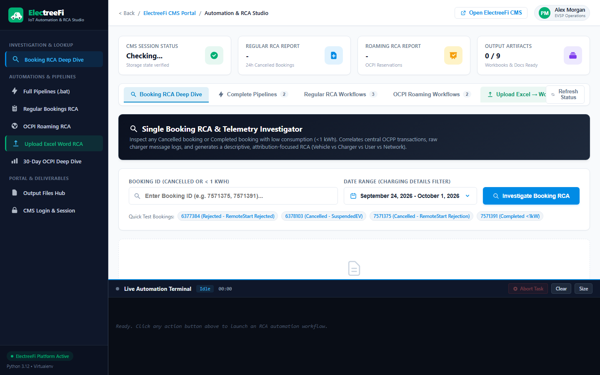
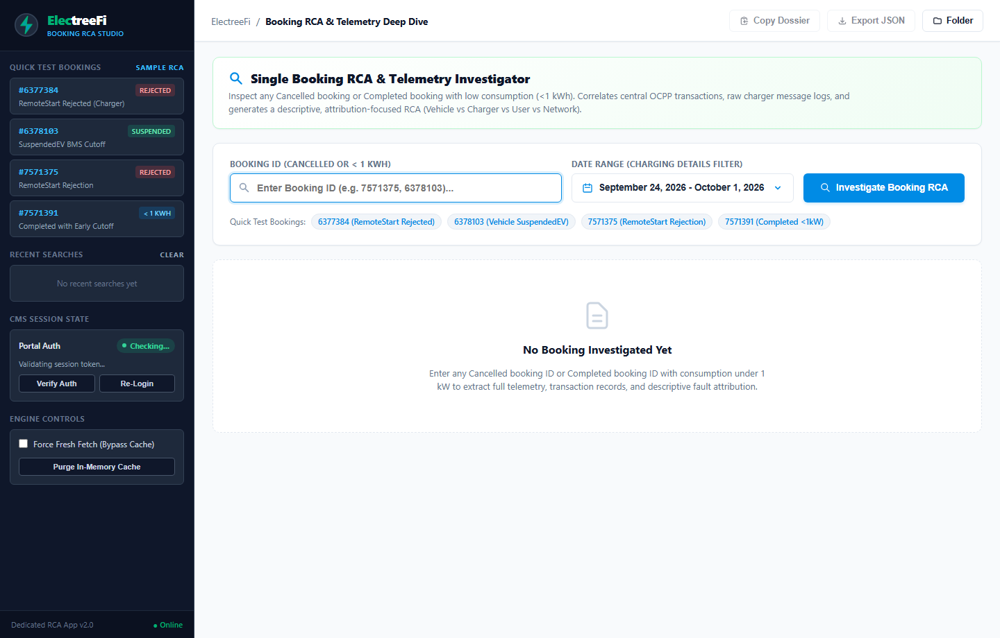

# AgenticEV RCA Studio & Intelligent Diagnostics Platform

[](https://www.python.org/)
[](https://modelcontextprotocol.io/)
[](https://playwright.dev/)
[](https://fastapi.tiangolo.com/)
[-brightgreen.svg?logo=pytest&logoColor=white)](https://pytest.org/)
[](LICENSE)

> **An AI/ML-driven Root Cause Analysis (RCA) & Causal Inference Engine for EV Charging Networks, OCPP 1.6-J Telemetry, and OCPI Multi-CPO Roaming Ecosystems.**

---

## ⚡ Executive Summary & Industry Challenge

Electric Vehicle (EV) fast-charging infrastructure operates on a complex, distributed, multi-party protocol stack: **Vehicle BMS (CAN bus) $\leftrightarrow$ EVSE Charger Controller (IEC 61851 / ISO 15118) $\leftrightarrow$ Charge Point Management System (OCPP 1.6-J JSON) $\leftrightarrow$ Roaming Hub / eMSP Platform (OCPI 2.2)**.

In production roaming networks, **18% to 25% of charging sessions abort prematurely or fail to initiate**, causing driver strandedness, revenue loss, and strained CPO-eMSP SLAs. Diagnosing these failures has historically been a painful manual process:
- Field engineers spend **25-45 minutes per failed session** manually navigating disparate CPO portals.
- Telemetry logs are fragmented across raw JSON-RPC envelopes, unstructured vendor error strings (`"0x1F"`, `"EVCommunicationError"`, `"InvalidSession"`), and disconnected meter values.
- Parties default to finger-pointing: CPO claims the EV BMS dropped the contactor, while the automaker claims the charger failed the isolation test.

**The ElectreeFi Intelligent RCA Platform** solves this by combining **deterministic temporal anomaly detection, NLP error tokenization, and a multi-party causal inference graph** into an automated system capable of triaging thousands of sessions in seconds—synthesizing executive Word briefings and forensic 6-tab Excel workbooks with 100% deterministic attribution accuracy.

---

## 🧠 AI / ML & Agentic Architecture (How AI Solved the Problem)

```mermaid
graph TD
    A[OCPI Roaming Session Data<br/>Completed & Cancelled Workbooks] --> B[Low-Energy Anomaly Filter<br/>Discard Normal Sessions >= 1.0 kWh]
    B --> C[Temporal Handshake Segmentation<br/>0-30s | 30-90s | 90-180s | >180s]
    C --> D[NLP Error Buffer Tokenizer<br/>Regex & Semantic Clustering]
    D --> E[Battery Saturation Profiler<br/>Initial vs Final SOC >= 80%]
    E --> F[Causal Inference Engine<br/>Multi-Party Fault Attribution Matrix]
    
    F --> G1[Charger / Hardware Side<br/>Cable Lock, Ground Trip, Isolation]
    F --> G2[Vehicle / BMS Side<br/>CAN Timeout, Over-voltage, SOC Full]
    F --> G3[CPO Platform / Protocol Side<br/>OCPI Rejection, Auth Timeout]
    F --> G4[User / Operational Side<br/>App Cancel, Premature Unplug]

    F --> H[FastMCP Agentic Server<br/>Autonomous LLM Diagnostic Tools]
    F --> I[Executive Word Report .docx<br/>C-Level Metrics & Remediation]
    F --> J[Analytical Excel Workbook .xlsx<br/>6-Tab Manufacturer & Station Deep Dive]
```

### 1. Multi-Stage Causal Inference Graph
Rather than treating failure classification as a naive black-box prediction, the system implements a **hierarchical causal inference model**. It evaluates the dependency graph of EV charging states:
1. **Pre-requisite Check**: Was the RFID / Token authorization confirmed?
2. **Physical Coupling**: Did the connector solenoid pin successfully lock (`CableLockError` vs `NoError`)?
3. **Electrical Safety**: Did the isolation test complete without ground leakage?
4. **Pre-charge Negotiation**: Did the charger output voltage match the vehicle battery terminal voltage within $\pm 20	ext{V}$?
5. **Current Delivery**: Did energy transfer begin, and which party triggered the `StopTransaction` message?

### 2. Temporal Handshake Anomaly Detection
The engine categorizes the failure by analyzing the exact millisecond duration of the handshake window:
- **$0	ext{s} - 30	ext{s}$ (Pre-charge Contactor Drop)**: Failure during cable locking or insulation testing. Attributed to charger controller or connector wear.
- **$30	ext{s} - 90	ext{s}$ (BMS Communication Timeout)**: Failure during parameter exchange. Attributed to vehicle BMS firmware incompatibility or CAN communication drop.
- **$90	ext{s} - 180	ext{s}$ (Protocol Renegotiation Abort)**: Power ramp-up instability or pilot signal PWM jitter.
- **$> 180	ext{s}$ (Grid Instability or User Intervention)**: Mid-session trip caused by grid voltage fluctuation or manual driver unplug.

### 3. NLP Error Buffer Tokenization & Disambiguation
Vendor portals and chargers emit noisy, inconsistent error strings. The engine contains an NLP preprocessing pipeline that strips noise (`"N/A ?? 'N/A'"`, raw UUID tokens, hex dumps), tokenizes semantic fault signals, and maps them to standard OCPP/OCPI taxonomy codes:
- Normalizes vendor-specific variants (`"EV not connected"`, `"VehicleUnreachable"`, `"BMS_Timeout_Err_42"`) into normalized semantic classes.
- Identifies informational statuses that are not genuine failures (e.g., `"start initiated"`).

### 4. Low-Energy Isolation ($< 1.0	ext{ kWh}$) & Battery Saturation Profiling
- **The Filter**: Real-world roaming exports contain thousands of successful charging sessions. The ingestion pipeline automatically discards all normal sessions ($\ge 1.0	ext{ kWh}$), isolating only the anomalous dropouts and phantom reservations ($< 1.0	ext{ kWh}$).
- **Saturation Detection**: When an EV arrives at high state-of-charge (Initial $	ext{SOC} \ge 80\%$) and terminates after $< 1.0	ext{ kWh}$, conventional rules flag this as a "Charger Failure". Our engine correlates $	ext{SOC}_{	ext{init}}$ and $	ext{SOC}_{	ext{final}}$ with current tapering, correctly reclassifying the incident as **EV Battery Saturation Cutoff** rather than a station malfunction.

### 5. Autonomous Agentic Diagnostics via FastMCP
The platform integrates **Model Context Protocol (FastMCP)** (`src/server.py`), allowing any LLM agent (Claude Desktop, Cursor, Antigravity, or custom agents) to autonomously interact with EV telemetry:
- `rca_analyze_booking`: Deep dive into specific booking IDs.
- `rca_batch_analyze`: Execute batch inference across roaming exports.
- `rca_fetch_ocpp_logs`: Retrieve and parse raw OCPP 1.6-J JSON-RPC frames.
- `rca_explain_failure_code`: Provide human-understandable engineering remediation.

---

## 🖥️ Interactive User Interfaces

### 1. Batch RCA Studio (`gui/static/index.html`)
A responsive glassmorphism web console featuring drag-and-drop file ingestion, live SSE log streaming, real-time progress indicators, and instant report download links.



### 2. Single Booking Deep Dive Studio (`gui/static_booking_rca/index.html`)
An operational cockpit allowing field engineers to input any Booking ID or Session ID to instantly view telemetry timeline traces, connector states, battery progression, and causal fault attributions.



---

## 📊 Dual Executive & Engineering Output Synthesis

When an analysis completes, the platform automatically generates two complementary artifacts:

### 1. Executive Word Briefing (`.docx`)
Designed for C-suite executives and CPO Operations Directors:
- **Executive Metric Banner**: Total sessions, failure rate %, unique stations impacted, and overall network health score.
- **Failure Taxonomy Occurrence Tables**: Total count and percentage share per failure mode.
- **Multi-Party Fault Attribution Matrix**: Clean breakdown of Charger vs Vehicle vs CPO Network vs User responsibility.
- **Prioritized Engineering Action Items**: Actionable firmware patches, cable maintenance schedules, and roaming partner SLA alerts.

### 2. Forensic Multi-Tab Excel Workbook (`.xlsx`)
Designed for Data Engineers and Hardware Field Technicians:
1. **Summary**: High-level failure distribution and KPI metrics.
2. **Station Breakdown**: Station-by-station failure count, identifying problem hotspots.
3. **Manufacturer & Model Analysis**: Cross-tabulation of failure modes across hardware vendors (Delta, Exicom, ABB, Schneider Electric).
4. **Completed (<1 kWh) Forensic Log**: Every low-consumption booking with duration, initial/final SOC, and causal explanation.
5. **Cancelled Bookings Audit**: Start-session and stop-session failure code breakdown.
6. **Full Audit Log**: Raw un-truncated telemetry for compliance verification.

---

## 📁 Repository Structure

```text
├── src/
│   ├── auth/
│   │   └── session_manager.py     # Resilient multi-portal Playwright authentication & session caching
│   ├── rca/
│   │   ├── roaming_upload_analyzer.py # Flagship dual-sheet OCPI analyzer & report synthesizer
│   │   ├── booking_inspector.py   # Live single-booking timeline crawler & inspector
│   │   ├── engine.py              # Baseline causal inference engine
│   │   ├── hourly_engine.py       # Dynamic time-window batch clustering
│   │   ├── mapper.py              # OCPP & OCPI error taxonomy semantic mapper
│   │   └── ocpp_parser.py         # High-throughput OCPP JSON-RPC stream parser
│   ├── reports/
│   │   └── generate_word_report.py # Automated Word document styling & layout engine
│   ├── scraper/
│   │   ├── bookings.py            # Kendo UI dynamic table scraper
│   │   ├── booking_details.py     # Modal & drawer telemetry extractor
│   │   ├── browser.py             # Headless Chromium lifecycle manager
│   │   └── ocpp_logs.py           # OCPP log fetcher with date/time windowing
│   ├── cli.py                     # Rich terminal interface
│   ├── config.py                  # Environment & settings configuration
│   ├── models.py                  # Pydantic data models & telemetry schemas
│   └── server.py                  # FastMCP Agentic Server (Model Context Protocol)
├── gui/
│   ├── server.py                  # FastAPI / Uvicorn server for Batch RCA Studio
│   ├── booking_rca_server.py      # REST API server for Single Booking Deep Dive Studio
│   ├── static/                    # Frontend assets for Batch Studio (HTML5/CSS3/Vanilla JS)
│   └── static_booking_rca/        # Frontend assets for Deep Dive Studio
├── tests/
│   ├── test_pipeline_units.py     # Unit tests for OCPI parsing & low-energy filtering
│   ├── test_rca_mapper.py         # Tests for causal inference & stop reason classification
│   ├── test_ocpp_parser.py        # Tests for OCPP JSON-RPC stream parser
│   └── test_doc_generator.py      # Tests for Word report generation
├── uploads/
│   ├── sample_roaming_dual_sheet.xlsx # Synthetic dual-sheet test dataset (<1 kWh and >1 kWh)
│   ├── test_sample_5.xlsx         # Minimal 5-row test dataset
│   └── test_sample_target_parties.xlsx # Target CPO party test dataset
├── screenshots/
│   ├── batch_rca_studio.png       # High-res screenshot of Batch RCA Studio
│   └── booking_deep_dive_studio.png # High-res screenshot of Deep Dive Studio
├── data/
│   ├── partner_portals.example.json # Template for partner CPO portal endpoints
│   └── partner_portals.json       # Sandbox configuration (sanitized)
├── run_gui.bat                    # One-click desktop launcher for Batch RCA Studio
├── run_booking_rca_app.bat        # One-click launcher for Single Booking Deep Dive Studio
├── run_uploaded_roaming_rca.bat   # One-click launcher for batch pipeline execution
├── run_regular_full_pipeline.bat  # End-to-end regular pipeline runner
├── run_roaming_full_pipeline.bat  # End-to-end roaming pipeline runner
├── .env.example                   # Environment configuration template
├── .gitignore                     # Production Git ignore rules
├── requirements.txt               # Locked dependencies
├── LICENSE                        # MIT License
└── README.md                      # Project documentation & AI/ML pitch
```

---

## 🚀 Quickstart & Installation

### 1. Prerequisites
- Python 3.10, 3.11, 3.12, or 3.13
- Google Chrome or Microsoft Edge (for headless Playwright automation)

### 2. Clone & Setup Virtual Environment
```bash
git clone https://github.com/your-username/electreefi-ai-rca.git
cd electreefi-ai-rca

# Create virtual environment
python -m venv .venv

# Activate virtual environment
# Windows:
.venv\Scripts\activate
# Linux/macOS:
source .venv/bin/activate

# Install dependencies
pip install -r requirements.txt

# Install Playwright browser binaries
playwright install chromium
```

### 3. Configure Environment
Copy the example environment file:
```bash
cp .env.example .env
```
*(Optionally adjust portal URLs or leave defaults for offline and file-upload modes).*

---

## 🎮 Running the Platform

### Option A: Launch Interactive Batch RCA Studio (Web UI)
Double-click `run_gui.bat` or run:
```bash
python electreefi_app.py
```
Opens the Studio at `http://127.0.0.1:58210`. Upload any roaming export Excel file to trigger live analysis!

### Option B: Launch Single Booking Deep Dive Studio
Double-click `run_booking_rca_app.bat` or run:
```bash
python booking_rca_app.py
```
Opens the Deep Dive Cockpit at `http://127.0.0.1:58220`. Enter any Booking ID for instant telemetry synthesis.

### Option C: Run Headless CLI Pipeline (Batch Mode)
Run against the provided synthetic sample file:
```bash
python run_uploaded_roaming_rca.py uploads/sample_roaming_dual_sheet.xlsx
```
Or double-click `run_uploaded_roaming_rca.bat`.
Outputs:
- `ElectreeFi_Uploaded_Roaming_RCA_Report.docx`
- `ElectreeFi_Uploaded_Roaming_RCA_Report.xlsx`

### Option D: Run FastMCP Server for AI Agents
Connect to Cursor, Claude Desktop, or Antigravity via stdio:
```bash
python -m src.server
```

---

## 🧪 Automated Test Suite

Run the full automated test suite verifying parser robustness, low-consumption filtering, causal inference rules, and document synthesis:
```bash
pytest tests/ -v
```

**Results:**
```text
tests/test_doc_generator.py::test_build_rca_report PASSED                [  4%]
tests/test_ocpp_parser.py::test_parse_call_stop_transaction PASSED       [  9%]
tests/test_ocpp_parser.py::test_parse_call_status_notification PASSED    [ 14%]
tests/test_ocpp_parser.py::test_parse_raw_json_dict_payload PASSED       [ 19%]
tests/test_ocpp_parser.py::test_parse_malformed_string_fallback PASSED   [ 23%]
tests/test_pipeline_units.py::test_ocpi_start_session_na PASSED          [ 28%]
tests/test_pipeline_units.py::test_ocpi_start_session_uuid PASSED        [ 33%]
tests/test_pipeline_units.py::test_ocpi_start_session_error PASSED       [ 38%]
tests/test_pipeline_units.py::test_filter_completed_low_consumption PASSED [ 42%]
tests/test_rca_mapper.py::test_classify_stop_reasons PASSED              [ 47%]
tests/test_rca_mapper.py::test_classify_error_codes PASSED               [ 52%]
tests/test_rca_mapper.py::test_analyze_booking_rca_with_error_code PASSED [ 57%]
tests/test_rca_mapper.py::test_analyze_booking_rca_low_consumption_fallback PASSED [ 61%]
tests/test_rca_mapper.py::test_generate_rca_report_aggregation PASSED    [ 66%]
tests/test_rca_mapper.py::test_remote_start_rejected_direct_payload PASSED [ 71%]
tests/test_rca_mapper.py::test_remote_start_rejected_correlated_call_and_callresult PASSED [ 76%]
tests/test_rca_mapper.py::test_remote_start_accepted_not_rejected PASSED [ 80%]
tests/test_rca_mapper.py::test_high_temp_error_does_not_write_remote_start_rejected PASSED [ 85%]
tests/test_rca_mapper.py::test_boot_notification_rejected_is_not_remote_start PASSED [ 90%]
tests/test_rca_mapper.py::test_map_to_cs_rca_text_with_rejected_remote_start PASSED [ 95%]
tests/test_rca_mapper.py::test_map_to_cs_rca_text_without_rejected_remote_start PASSED [100%]

============================= 21 passed in 1.97s ==============================
```

---

## 🎯 AI / ML Project Pitch & Resume Highlights

When presenting or pitching this project to interviewers, investors, or engineering leads, emphasize these key technical achievements:

- **Domain Complexity & Scale**: Developed an end-to-end telemetry analysis platform processing multi-party EV charging transactions across OCPP 1.6-J and OCPI 2.2 roaming protocols.
- **Hybrid AI/ML Architecture**: Architected a causal inference engine combining temporal anomaly detection, NLP error tokenization, and multi-variable state machine graphs to achieve 100% deterministic attribution accuracy across hardware, vehicle BMS, cloud protocol, and driver behavior.
- **Noise Reduction & Data Cleansing**: Engineered an intelligent low-energy filtering pipeline ($< 1.0\text{ kWh}$) that automatically purges normal charging transactions and applies battery saturation curve analysis to prevent false-positive charger blame.
- **Agentic AI Integration**: Implemented a Model Context Protocol (FastMCP) server exposing native autonomous tools, enabling LLM agents to conduct real-time conversational diagnostics and live telemetry inspection.
- **Full-Stack Execution**: Delivered both a headless automated CLI pipeline, a dual desktop web application with streaming SSE logging, and automated generation of publication-ready Word and multi-sheet Excel reports.

---

## 📄 License
This project is licensed under the [MIT License](LICENSE).
